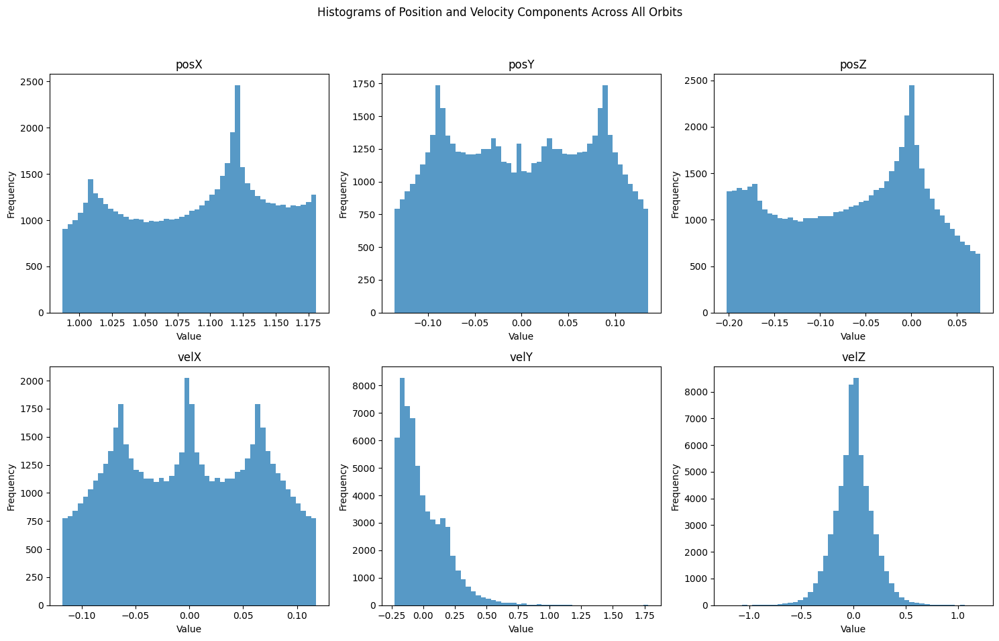

# orbit-generation-testing


<!-- WARNING: THIS FILE WAS AUTOGENERATED! DO NOT EDIT! -->

``` python
from orbit_generation.data import *
from orbit_generation.visualize import *
from orbit_generation.stats import *
from orbit_generation.processing import *
```

## Orbit Dataset Structure

The orbit dataset is organized within a three-dimensional numpy array
with the following structure:

<center>
<font size="5">data.shape = (num_orbits, 6, num_time_points)</font>
</center>

### Dimensions Detailed

- **`num_orbits`**: Total number of distinct orbits in the dataset.
- **`6`**: Represents the six scalar values for each orbit at each time
  point, typically including:
  - **`posX`**, **`posY`**, **`posZ`**: Position components in the X, Y,
    and Z dimensions, respectively.
  - **`velX`**, **`velY`**, **`velZ`**: Velocity components in the X, Y,
    and Z dimensions, respectively.
- **`num_time_points`**: Number of time instants at which the data for
  each orbit is recorded.

### Mathematical Representation

For an individual orbit $i$, the data is represented as a matrix $O_i$
of dimensions $6 \times T$, where $T$ represents the total number of
time points ($num\_time\_points$):

The orbit matrix $O_i$ for each orbit $i$ can be represented as:

$$
O_i = \left(\begin{array}{cccc}
posX_{1} & posX_{2} & \ldots & posX_{T} \\
posY_{1} & posY_{2} & \ldots & posY_{T} \\
posZ_{1} & posZ_{2} & \ldots & posZ_{T} \\
velX_{1} & velX_{2} & \ldots & velX_{T} \\
velY_{1} & velY_{2} & \ldots & velY_{T} \\
velZ_{1} & velZ_{2} & \ldots & velZ_{T} \\
\end{array}\right)
$$

And the state vector $vec{v}_{i,t}$ for orbit $i$ at time point $t$ is:

$$
\vec{v}_{i,t} = \left(\begin{array}{c}
posX_t \\
posY_t \\
posZ_t \\
velX_t \\
velY_t \\
velZ_t \\
\end{array}\right)
$$

Thus, the dataset can be envisioned as an assembly of matrices, each
encapsulating the trajectory and dynamical state of an orbit over time.

### Accessing the Data

- To retrieve the complete data for a specific orbit $i$, use
  `data[i, :, :]`.
- For all data points of a specific scalar measurement $j$ across all
  orbits and time points, use `data[:, j, :]`.
- To access data for a specific scalar measurement $j$ at a given time
  point $t$ across all orbits, the syntax is `data[:, j, t]`.

This structured approach facilitates efficient data storage and
retrieval, allowing for comprehensive and detailed analyses of the
orbits.

## Install

``` sh
pip install orbit_generation_testing
```

## How to use

### Get Example Data

``` python
orbit_data= get_example_orbit_data()
orbit_data.shape
```

    (200, 6, 300)

- Number of orbits: 200
- Time instants: 300

### Compute Statistics

``` python
plot_histograms(orbit_data)
```



### Plot Orbits

``` python
visualize_static_orbits(orbit_data, orbit_indices= [1,15,30,50,80,100], time_instants=[0], show_legend=True)
```


``` python
visualize_static_orbits(orbit_data)
```


``` python
export_dynamic_orbits_html(orbit_data)
```

    Visualization saved to orbits.html
